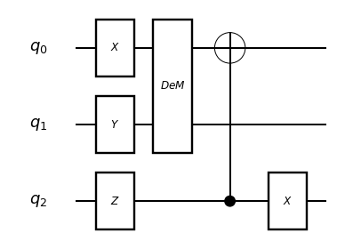
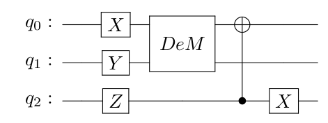

# qulacs-visualizer

[](https://github.com/Qulacs-Osaka/qulacs-visualizer/actions/workflows/ci.yml) [](https://github.com/Qulacs-Osaka/qulacs-visualizer/actions/workflows/doc.yml) [](https://badge.fury.io/py/qulacsvis) [](LICENSE)

qulacs-visualizer is a quantum circuit drawing library for [qulacs](https://github.com/qulacs/qulacs). This library only supports Python. Not available in C/C++.

qulacs-visualizer supports the following methods.

- Text-Based Drawing
- Matplotlib Drawing
  - using [matplotlib](https://github.com/matplotlib/matplotlib)
- LaTeX Drawing
  - using LaTeX and the [qcircuit package](https://github.com/CQuIC/qcircuit)


## Quick Install

Install using `pip` from PyPI:

```
pip install qulacsvis
```

## Example


For more information, see the [documentation](https://qulacs-osaka.github.io/qulacs-visualizer/index.html).
The documentation describes the [other options available](https://qulacs-osaka.github.io/qulacs-visualizer/options.html).

### Text-Based Drawing

In text-based mode, draws the circuit as ASCII art. This mode is the default behavior.

```py
from qulacs import QuantumCircuit
from qulacsvis import circuit_drawer

# Build a quantum circuit
circuit = QuantumCircuit(3)
circuit.add_X_gate(0)
circuit.add_Y_gate(1)
circuit.add_Z_gate(2)
circuit.add_dense_matrix_gate(
    [0, 1], [[1, 0, 0, 0], [0, 1, 0, 0], [0, 0, 0, 1], [0, 0, 1, 0]]
)
circuit.add_CNOT_gate(2, 0)
circuit.add_X_gate(2)

# Draw a quantum circuit
circuit_drawer(circuit)
```
```
   ___     ___     ___
  | X |   |DeM|   |CX |
--|   |---|   |---|   |----------
  |___|   |   |   |___|
   ___    |   |     |
  | Y |   |   |     |
--|   |---|   |-----|------------
  |___|   |___|     |
   ___              |      ___
  | Z |             |     | X |
--|   |-------------●-----|   |--
  |___|                   |___|
```

### Matplotlib Drawing

To use another drawing method, you can specify it by setting a value to the `output_method` argument of the `circuit_drawer()` function. For matplotlib drawing, set `output_method="mpl"`.

```py
circuit_drawer(circuit, "mpl")
```



## LaTeX Drawing

For LaTeX drawing, set `output_method="latex"`.

```py
circuit_drawer(circuit, "latex")
```



If you want to output LaTeX code, set `output_method="latex_source"`.

```py
print(circuit_drawer(circuit, "latex_source"))
```

```latex
\documentclass[border={-2pt 5pt 5pt -7pt}]{standalone}
\usepackage[braket, qm]{qcircuit}
\usepackage{graphicx}

\begin{document}
    \Qcircuit @C=1.0em @R=0.7em @!R{ \\
        \nghost{ q_{0} : } & \lstick{ q_{0} : } & \gate{X} & \multigate{1}{DeM} & \targ & \qw & \qw\\
        \nghost{ q_{1} : } & \lstick{ q_{1} : } & \gate{Y} & \ghost{DeM} & \qw & \qw & \qw\\
        \nghost{ q_{2} : } & \lstick{ q_{2} : } & \gate{Z} & \qw & \ctrl{-2} & \gate{X} & \qw\\
    }
\end{document}
```

### Requirement

If you want to use LaTeX Drawing, you need to have a local environment where you can run LaTeX (pdflatex).
You will also need the [qcircuit package](https://github.com/CQuIC/qcircuit).
[TeX Live](https://www.tug.org/texlive/) and [MiKTeX](https://miktex.org/) have the qcircuit package installed by default.

## License

[MIT License](LICENSE)

## Contributors

We use [qqcd](https://github.com/mf-22/qqcd) for text-based drawing, a drawing library developed by [@mf-22](https://github.com/mf-22). Thank you.
